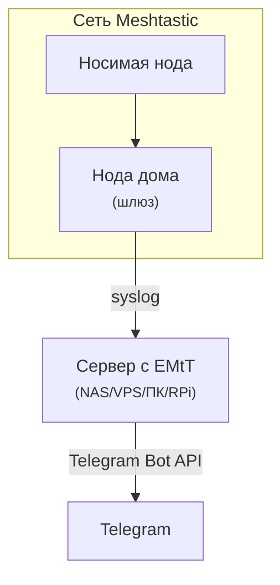
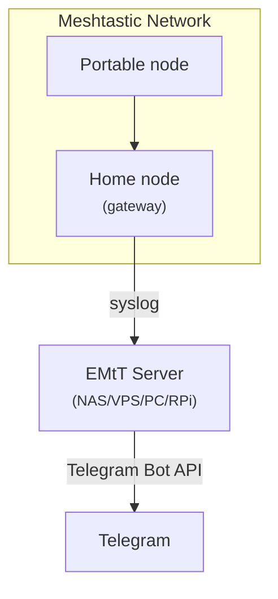

See [description in English](#easy-mesh-to-telegram-english) below 👇
<br>
<br>

# Easy Mesh to Telegram

[![Версия][releases-shield]][releases]
[![Подробности][blog-shield]][blog]
[![Boosty][boosty-shield]][boosty]
[![Telegram][telegram-shield]][telegram]

**EMtT** — это простой мост, который пересылает сообщения из радиосети Meshtastic® прямо в Telegram. Никакого MQTT, никаких лишних сложностей.

Проект основан на коде [петербургского моста](https://mansmarthome.info/posts/radio/kak-ia-sviazyval-meshtastic-i-telegram-istoriia-pietierburghskogho-mosta/?utm_source=github&utm_medium=referral&utm_campaign=emtt), который работает с 2023 года. Подробный рассказ о возможностях, сценариях использования и демонстрация работы EMtT [доступны в блоге](https://mansmarthome.info/posts/radio/emtt-most-meshtastic-v-telegram-uviedomlieniia-biez-intiernieta/?utm_source=github&utm_medium=referral&utm_campaign=emtt).

## Схема работы

EMtT — это по сути сервер для сбора логов (rsyslog). Meshtastic-нода отправляет логи на указанный IP и порт, EMtT парсит их и пересылает в Telegram.



## Установка

### Для подписчиков Boosty (готовые сборки)

Если вы не хотите разбираться с компиляцией и предпочитаете готовое решение, [поддержите проект на Boosty](https://boosty.to/mansmarthome/posts/ca2ddb88-d808-419b-8faf-5d5619f66b95). В благодарность за подписку вы получите доступ к:
- **Готовым Docker-образам** для архитектур `amd64` (серверы, ПК) и `aarch64` (Raspberry Pi, NAS).
- **Установщику для Windows** (с GUI) для простой установки и настройки.
- **Скомпилированным бинарникам** для Linux (`amd64`, `aarch64`).
- **Подробной документации** по настройке и использованию.

### Open Source (сборка из исходников)

Исходный код полностью открыт на GitHub. Всё, что вам понадобится — это Rust и Cargo.

**Через Cargo:**

1. Клонируйте репозиторий:
   ```bash
   git clone https://github.com/black-roland/emtt.git
   cd emtt
   ```
2. Соберите проект в режиме release:
   ```bash
   cargo build --release
   ```
3. Готовый исполняемый файл будет находиться в директории `target/release/emtt`. Вы можете скопировать его в удобное место, например, `/usr/local/bin`:
   ```bash
   sudo cp target/release/emtt /usr/local/bin/
   ```

**Через Docker:**

```bash
git clone https://github.com/black-roland/emtt.git
cd emtt
docker build -t emtt .
```

## Быстрый старт

1. **Создайте Telegram-бота** через [@BotFather](https://t.me/BotFather) и получите его токен.
2. **Узнайте ID чата** (это может быть ID пользователя или группы). Можно использовать бота [@myidbot](https://t.me/myidbot).
3. Запустите EMtT:
   ```bash
   emtt syslog --chat-id=<ID_чата_или_пользователя> --bot-token=<токен_бота_в_Telegram>
   ```

   EMtT запустится и начнет слушать UDP-порт `50514` на всех сетевых интерфейсах.

### Настройка Meshtastic-ноды (шлюза)

1. Подключитесь к ноде через приложение Meshtastic (iOS/Android) или через CLI.
2. Перейдите в настройки Wi-Fi и подключите ноду к вашей домашней сети.
3. В настройках сети найдите поле **«Rsyslog server»** (или «Сервер syslog»).
4. Введите IP-адрес вашего сервера, на котором запущен EMtT, и порт `50514` в формате: `<IP-адрес>:50514`.

Готово! Теперь все личные сообщения, которые получит ваша нода-шлюз, будут дублироваться в Telegram-чат.

## Конфигурация

EMtT настраивается через аргументы командной строки или переменные окружения. Полный список параметров доступен в справке: `emtt syslog --help`.

### Примеры

**Настройка через аргументы командной строки:**
```bash
emtt --log-level=info syslog --bot-token=7726737401:... --chat-id=-1001234567890
```

**Через переменные окружения:**
```bash
export TELEGRAM_BOT_TOKEN="7726737401:..."
export TELEGRAM_CHAT_ID="-1001234567890"
export LOG_LEVEL="info"
emtt syslog
```

**Docker:**
```bash
docker run -e TELEGRAM_BOT_TOKEN="7726737401:..." \
           -e TELEGRAM_CHAT_ID="-1001234567890" \
           -p 50514:50514/udp \
           emtt
```

**Отправка в вебхук вместо Telegram:**
```bash
emtt syslog --webhook-url=https://webhook.site/832f928d-dfc5-4d4b-875f-3983361d0480
```

**Использование SOCKS5-прокси:**
```bash
emtt syslog --bot-token=7726737401:... --chat-id=-1001234567890 \
            --proxy-url=socks5://localhost:9050
```

**Self-hosted Telegram Bot API:**
```bash
emtt syslog --bot-token=7726737401:... --chat-id=-1001234567890 \
            --api-server=http://127.0.0.1:8081
```

### Шаблон Telegram-сообщений

Вы можете настроить формат сообщений, используя переменную окружения `TELEGRAM_TEMPLATE` или аргумент `--template`. Шаблон использует синтаксис Jinja2 (Minijinja) и поддерживает следующие переменные:

- `{{ from }}` — имя отправителя
- `{{ via }}` — имя промежуточного узла
- `{{ text }}` — текст сообщения
- `{{ snr }}` — Signal‑to‑Noise Ratio (может отсутствовать)
- `{{ rssi }}` — RSSI (может отсутствовать)
- `{{ hops_away }}` — количество прыжков до шлюза (может отсутствовать)

По умолчанию включено автоматическое экранирование подставляемых значений, поэтому вам не нужно переживать, что кто-то злонамеренно добавит специальные символы в текст сообщения или long name.

Заменить стандартный шаблон можно, например, так:

```bash
emtt syslog --template '📩 <b>{{ from }}</b>\n<blockquote>{{ text }}</blockquote>\n{{ hops_away | d(-1) }} 🐰'
```

Markdown:

```bash
emtt syslog --parse-mode markdown --template '📩 *{{ from }}*\n{{ text }}'
```

## Поддержка и обратная связь

- **Баг-репорты и предложения:** пожалуйста, создавайте [issues](https://github.com/black-roland/emtt/issues) на GitHub.
- **Pull requests и улучшения документации** приветствуются — см. [`CONTRIBUTING.md`](https://github.com/black-roland/emtt?tab=contributing-ov-file).
- **Готовые сборки и приоритетная поддержка** доступны для подписчиков [Boosty](https://boosty.to/mansmarthome/posts/ca2ddb88-d808-419b-8faf-5d5619f66b95).
- **Вопросы и обсуждения:** присоединяйтесь к [Telegram-чату](https://t.me/+BBhPhVEURE1iZTZi).

## Товарные знаки

Meshtastic® is a registered trademark of Meshtastic LLC. Meshtastic software components are released under various licenses, see [GitHub](https://github.com/meshtastic) for details. No warranty is provided — use at your own risk.

EMtT is not affiliated with or endorsed by the Meshtastic project. The official Meshtastic website is [meshtastic.org](https://meshtastic.org/).

## Лицензия

MPL-2.0 — подробности в файле [LICENSE](https://github.com/black-roland/emtt?tab=readme-ov-file#MPL-2.0-1-ov-file).

---

# Easy Mesh to Telegram (English)

[![Version][releases-shield]][releases]

**EMtT** is a simple bridge that forwards messages from the Meshtastic® radio network to Telegram. No MQTT, no unnecessary complexity.

The project is based on the code of the [St. Petersburg public bridge](https://mansmarthome.info/posts/radio/kak-ia-sviazyval-meshtastic-i-telegram-istoriia-pietierburghskogho-mosta/?utm_source=github&utm_medium=referral&utm_campaign=emtt) (RU), which has been running since 2023. For a detailed overview, use cases, and a demo, [check out the blog post](https://mansmarthome.info/posts/radio/emtt-most-meshtastic-v-telegram-uviedomlieniia-biez-intiernieta/?utm_source=github&utm_medium=referral&utm_campaign=emtt) (RU).

## How it works

EMtT is essentially a syslog server. Your Meshtastic node sends logs via Wi-Fi, EMtT parses them and forwards messages to Telegram.



## Quick start

```bash
emtt syslog --bot-token=<your_bot_token> --chat-id=<chat_id>
```

For a complete list of options, use `emtt syslog --help` — the app itself supports English.

## Support

- **Issues & feature requests:** [GitHub Issues](https://github.com/black-roland/emtt/issues)
- **Pull requests:** See [`CONTRIBUTING.md`](https://github.com/black-roland/emtt/blob/master/CONTRIBUTING.md)
- **Pre-built binaries:** [Boosty](https://boosty.to/mansmarthome/posts/ca2ddb88-d808-419b-8faf-5d5619f66b95) (RU)
- **Discussions:** [Telegram chat](https://t.me/+BBhPhVEURE1iZTZi)

## Trademarks

Meshtastic® is a registered trademark of Meshtastic LLC. Meshtastic software components are released under various licenses, see [GitHub](https://github.com/meshtastic) for details. No warranty is provided — use at your own risk.

EMtT is not affiliated with or endorsed by the Meshtastic project. The official Meshtastic website is [meshtastic.org](https://meshtastic.org/).

## License

MPL-2.0 — see [LICENSE](https://github.com/black-roland/emtt?tab=readme-ov-file#MPL-2.0-1-ov-file).

[releases-shield]: https://img.shields.io/badge/1.2.3-версия-blue?logo=github&style=flat-square&cacheSeconds=86400
[releases]: https://github.com/black-roland/emtt/blob/master/CHANGELOG.md
[blog-shield]: https://img.shields.io/badge/Демо-cc3336?style=flat-square&logo=readthedocs
[blog]: https://mansmarthome.info/posts/radio/emtt-most-meshtastic-v-telegram-uviedomlieniia-biez-intiernieta/?utm_source=github&utm_medium=referral&utm_campaign=emtt
[boosty-shield]: https://img.shields.io/badge/Boosty-готовые_сборки-orange?style=flat-square&logo=boosty
[boosty]: https://boosty.to/mansmarthome/posts/ca2ddb88-d808-419b-8faf-5d5619f66b95
[telegram-shield]: https://img.shields.io/badge/Telegram-чат-blue?style=flat-square&logo=telegram
[telegram]: https://t.me/+BBhPhVEURE1iZTZi
